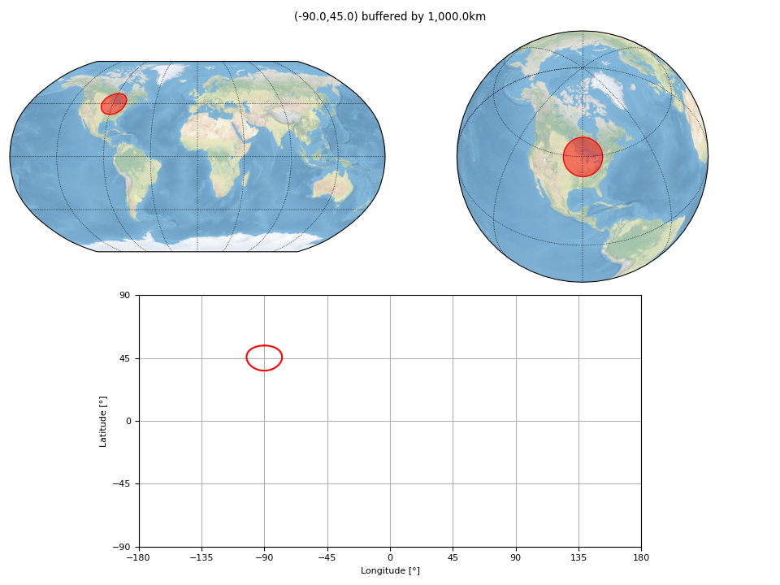
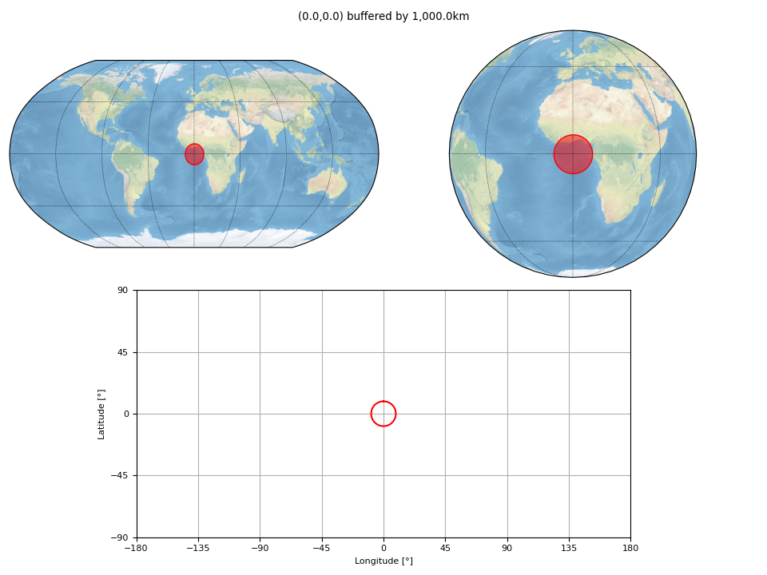
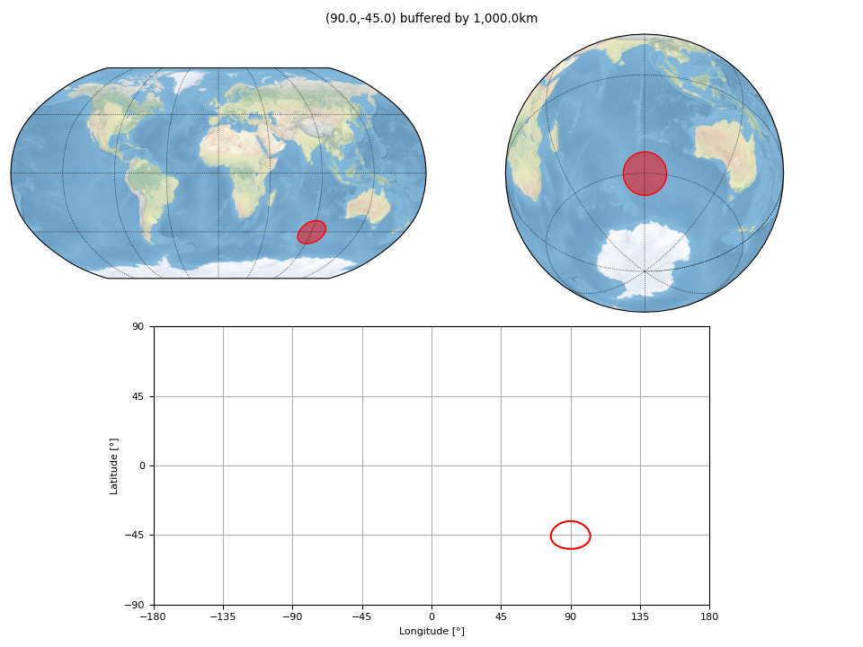
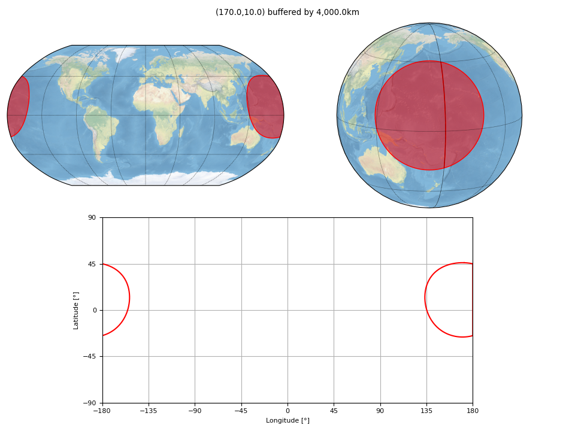
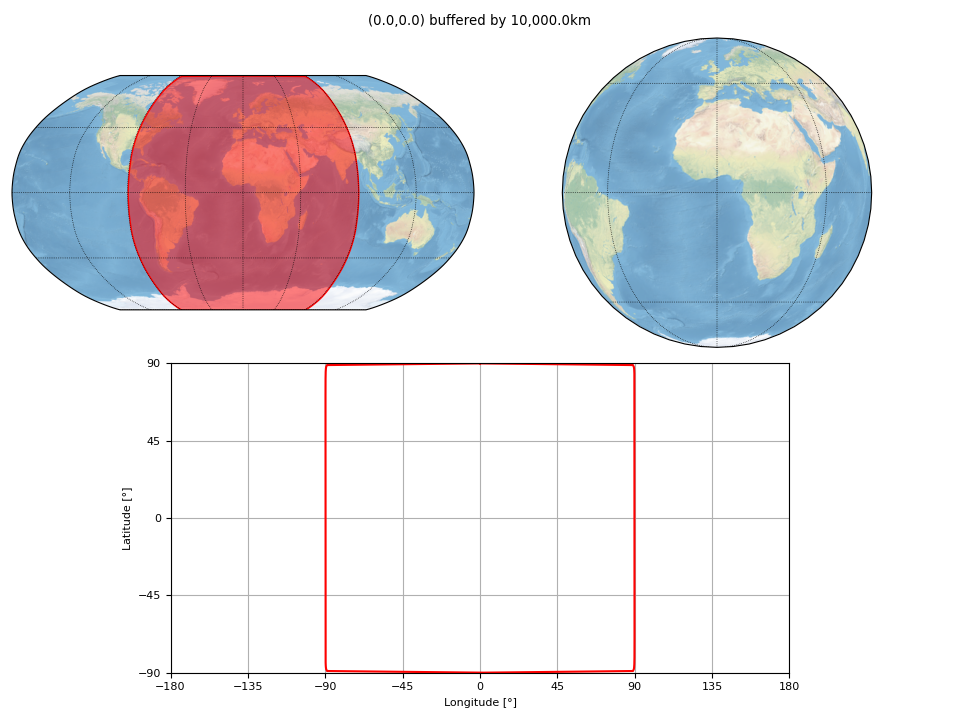

Test :func:`pyguymer3.geo.buffer` (on Points)
^^^^^^^^^^^^^^^^^^^^^^^^^^^^^^^^^^^^^^^^^^^^^

The function :func:`pyguymer3.geo.buffer` is tested by the script
:download:`bufferPoint.py <../tests/bufferPoint.py>` which produces the images
below.

.. image:: ../tests/bufferPoint/bufferPoint0.png

.. image:: ../tests/bufferPoint/bufferPoint4.png

.. image:: ../tests/bufferPoint/bufferPoint6.png

.. image:: ../tests/bufferPoint/bufferPoint7.png

.. image:: ../tests/bufferPoint/bufferPoint8.png

