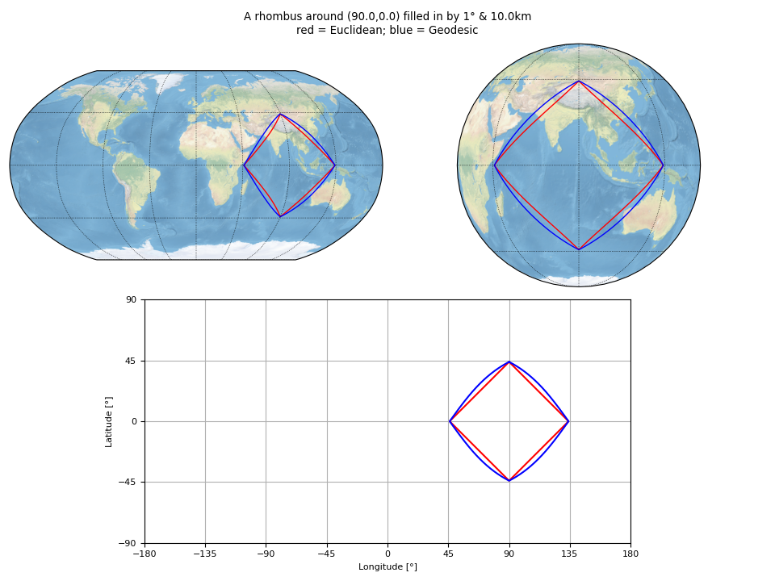
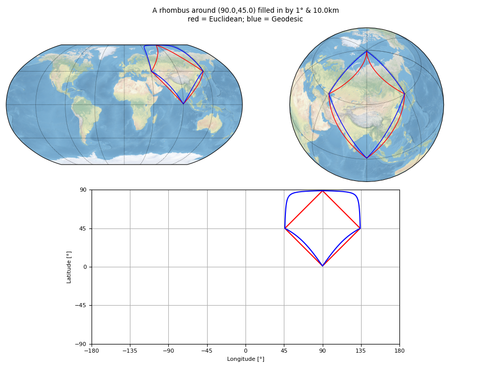

Test :func:`pyguymer3.geo.fillin`
^^^^^^^^^^^^^^^^^^^^^^^^^^^^^^^^^

The function :func:`pyguymer3.geo.fillin` is tested by the script
:download:`fillin.py <../tests/fillin.py>` which produces the images below.

.. image:: ../tests/fillin/fillin0.png

.. image:: ../tests/fillin/fillin2.png

