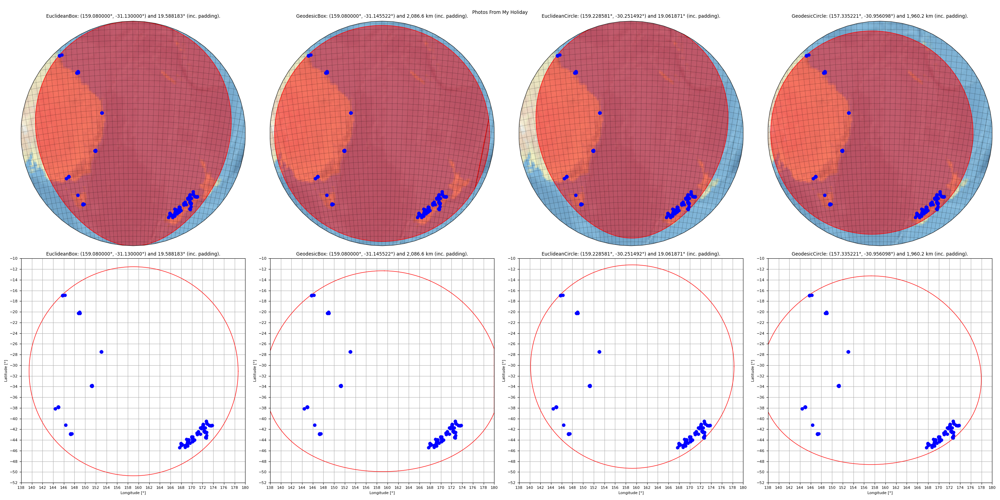

Test :func:`pyguymer3.geo.find_middle_of_locs`
^^^^^^^^^^^^^^^^^^^^^^^^^^^^^^^^^^^^^^^^^^^^^^

The function :func:`pyguymer3.geo.find_middle_of_locs` is tested by the script
:download:`findMiddleOfLocs.py <../tests/findMiddleOfLocs.py>` which produces
the image below.

