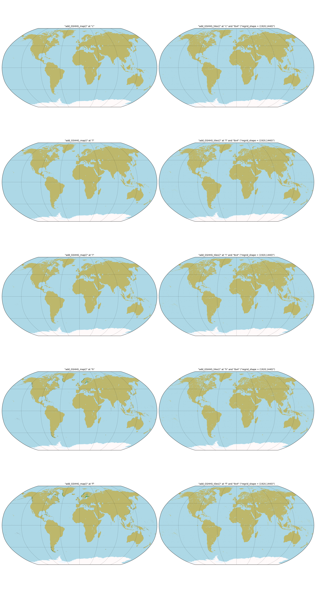
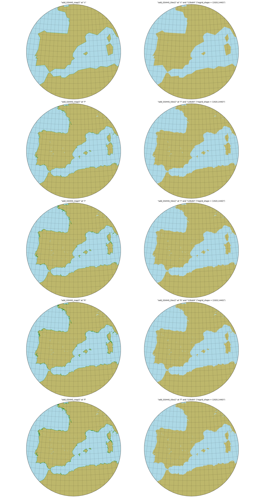
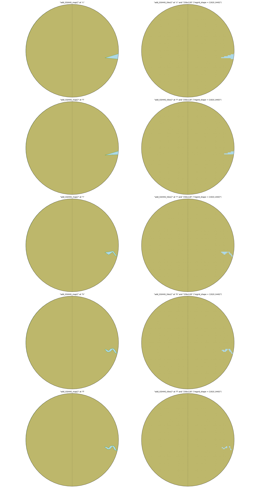
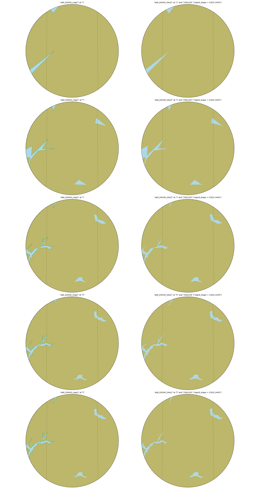

Test :func:`pyguymer3.geo.add_GSHHG_map` and :func:`pyguymer3.geo.add_GSHHG_tiles`
^^^^^^^^^^^^^^^^^^^^^^^^^^^^^^^^^^^^^^^^^^^^^^^^^^^^^^^^^^^^^^^^^^^^^^^^^^^^^^^^^^

The functions :func:`pyguymer3.geo.add_GSHHG_map` and
:func:`pyguymer3.geo.add_GSHHG_tiles` are tested by the script
:download:`mapGshhgUnderlay.py <../tests/mapGshhgUnderlay.py>` which produces
the images below.

