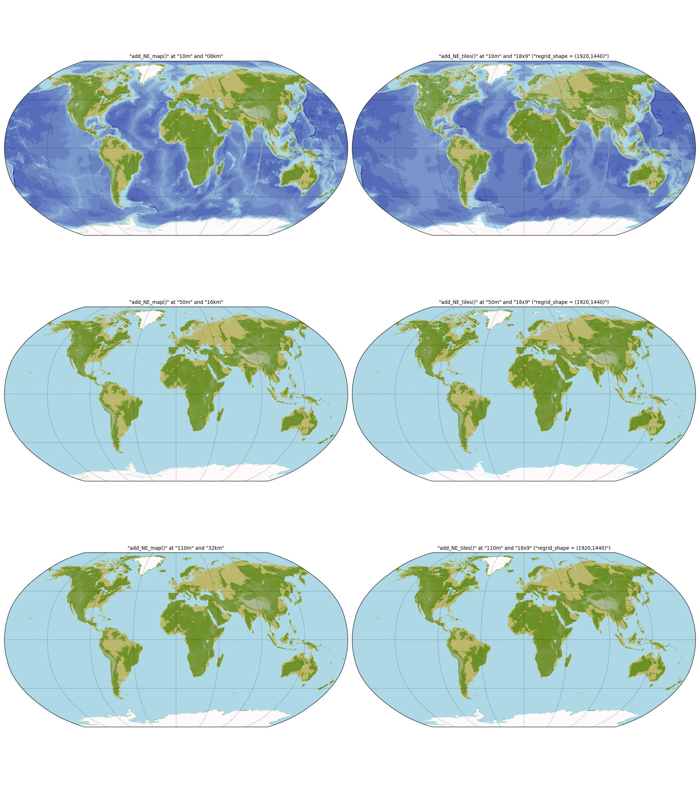
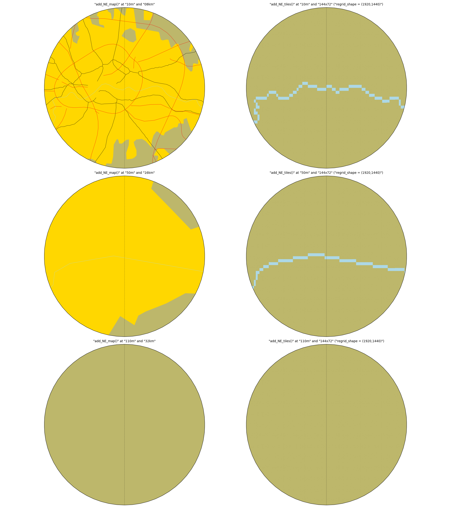

Test :func:`pyguymer3.geo.add_NE_map` and :func:`pyguymer3.geo.add_NE_tiles`
^^^^^^^^^^^^^^^^^^^^^^^^^^^^^^^^^^^^^^^^^^^^^^^^^^^^^^^^^^^^^^^^^^^^^^^^^^^^

The functions :func:`pyguymer3.geo.add_NE_map` and
:func:`pyguymer3.geo.add_NE_tiles` are tested by the script
:download:`mapNeUnderlay.py <../tests/mapNeUnderlay.py>` which produces the images
below.

.. image:: ../tests/mapNeUnderlay/mapNeUnderlay1.png

.. image:: ../tests/mapNeUnderlay/mapNeUnderlay3.png
