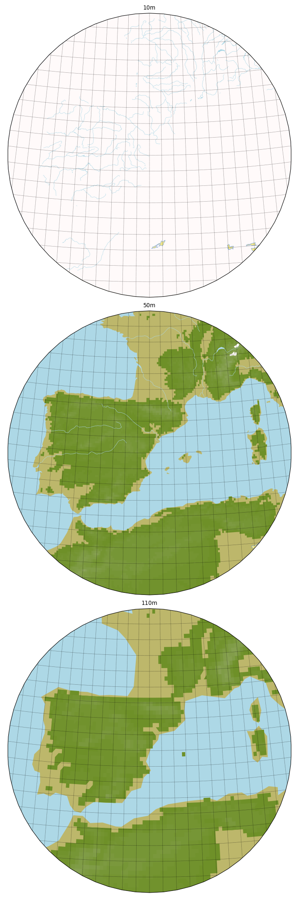
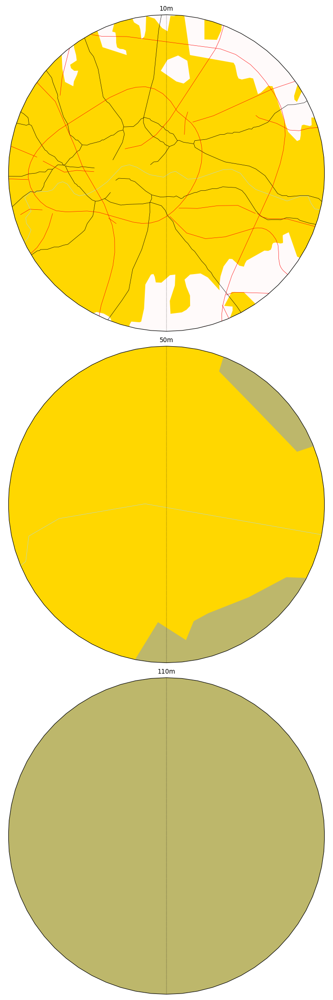
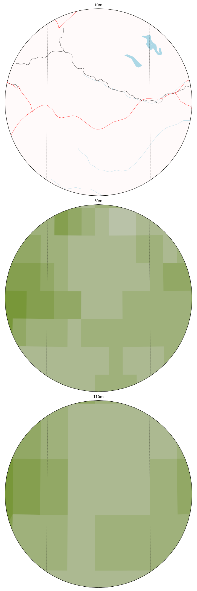

Test :func:`pyguymer3.geo.add_map_underlay`
^^^^^^^^^^^^^^^^^^^^^^^^^^^^^^^^^^^^^^^^^^^

The function :func:`pyguymer3.geo.add_map_underlay` is tested by the script
:download:`mapUnderlay.py <../tests/mapUnderlay.py>` which produces the images
below.

.. image:: ../tests/mapUnderlay/mapUnderlay0.png

