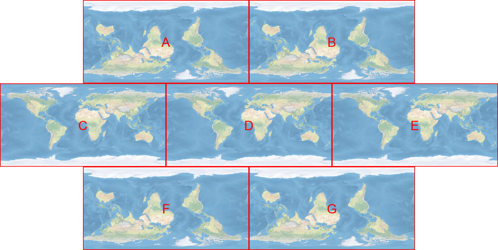

## Data Types

* A `shapely.geometry.point.Point` is made up of a `shapely.coords.CoordinateSequence` of 1 `tuple` of a (lon,lat) pair.
* A `shapely.geometry.polygon.LinearRing` is made up of a `shapely.coords.CoordinateSequence` of N `tuple`s of (lon,lat) pairs.
* A `shapely.geometry.polygon.Polygon` is made up of a `shapely.geometry.polygon.LinearRing` exterior and N `shapely.geometry.polygon.LinearRing` interiors.
* A `shapely.geometry.multipolygon.MultiPolygon` is made up of N `shapely.geometry.polygon.Polygon`s.

## Call Graph

Public functions:

* `buffer()`
    * `buffer_CoordinateSequence()`
    * `buffer_Point()`
    * `buffer_LinearRing()`
    * `buffer_Polygon()`
    * `buffer_MultiPolygon()`
* `buffer_CoordinateSequence()` (this is the only function that actually does any buffering)
    * `f90.buffer_points_crudely()` or `_buffer_points_crudely()`
    * `_earthA()`
    * `_earthB()`
    * `_earthC()`
    * `_earthD()`
    * `_earthE()`
    * `_earthF()`
    * `_earthG()`
    * `shapely.ops.unary_union()`
    * `shapely.geometry.multipolygon.MultiPolygon.simplify()`
* `buffer_Point()`
    * `buffer_CoordinateSequence()`
* `buffer_LinearRing()`
    * `buffer_CoordinateSequence()`
* `buffer_Polygon()`
    * `buffer_LinearRing()`
    * `shapely.ops.unary_union()`
    * `shapely.geometry.multipolygon.MultiPolygon.simplify()`
* `buffer_MultiPolygon()`
    * `buffer_Polygon()`
    * `shapely.ops.unary_union()`
    * `shapely.geometry.multipolygon.MultiPolygon.simplify()`

## Multiple Earths

To take account of the looping nature of the longitude/latitude Geodesic coordinate system of planet Earth, `buffer_CoordinateSequence()` has multiple copies of Earth which are then collapsed down on to one Earth: "Earth-D".

