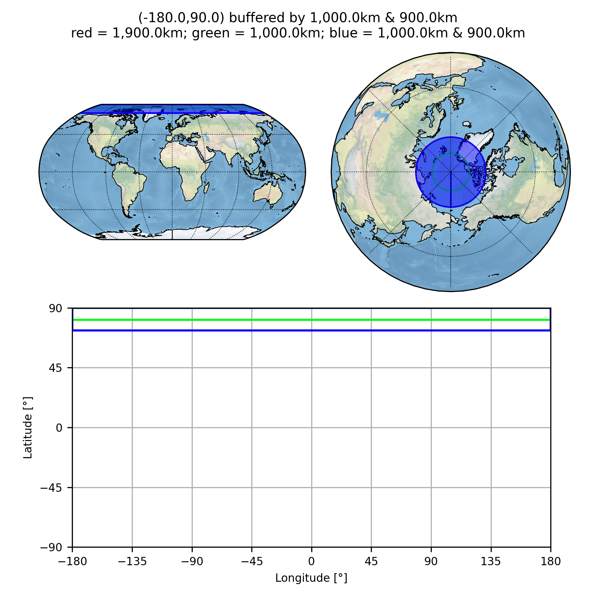
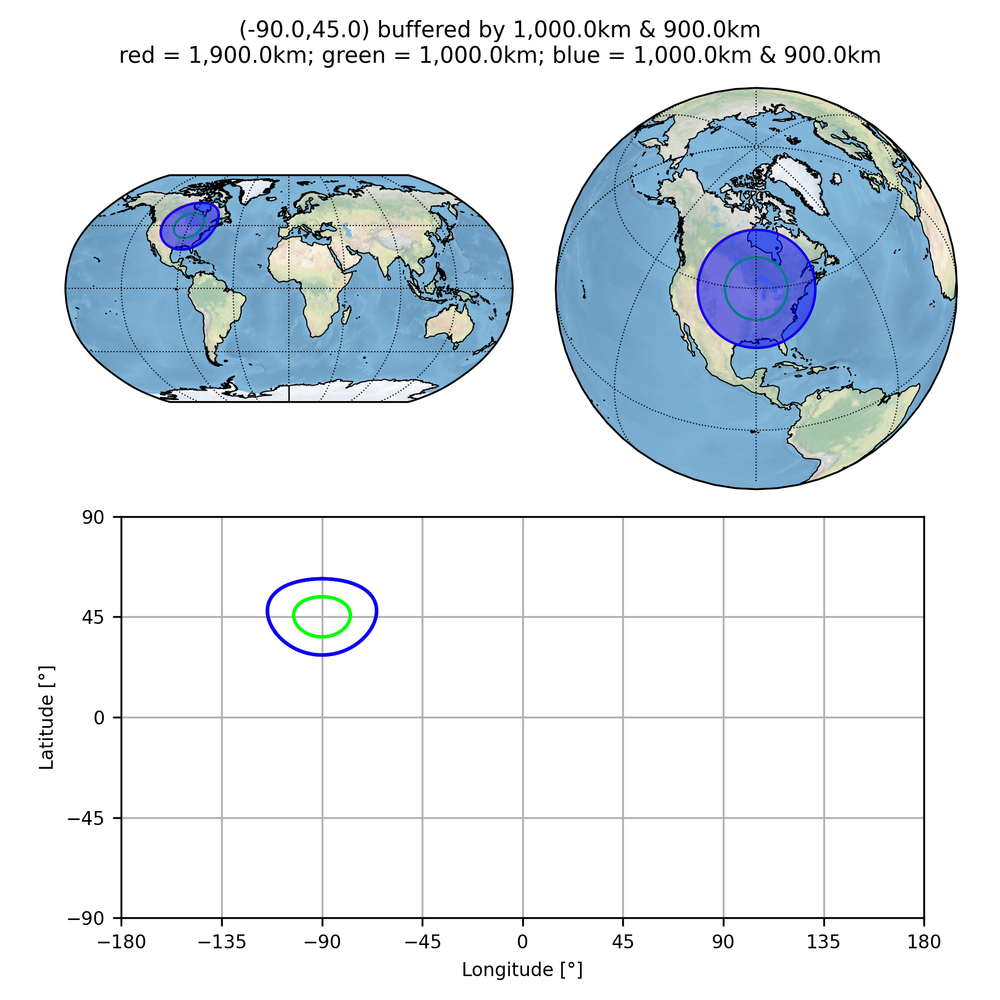
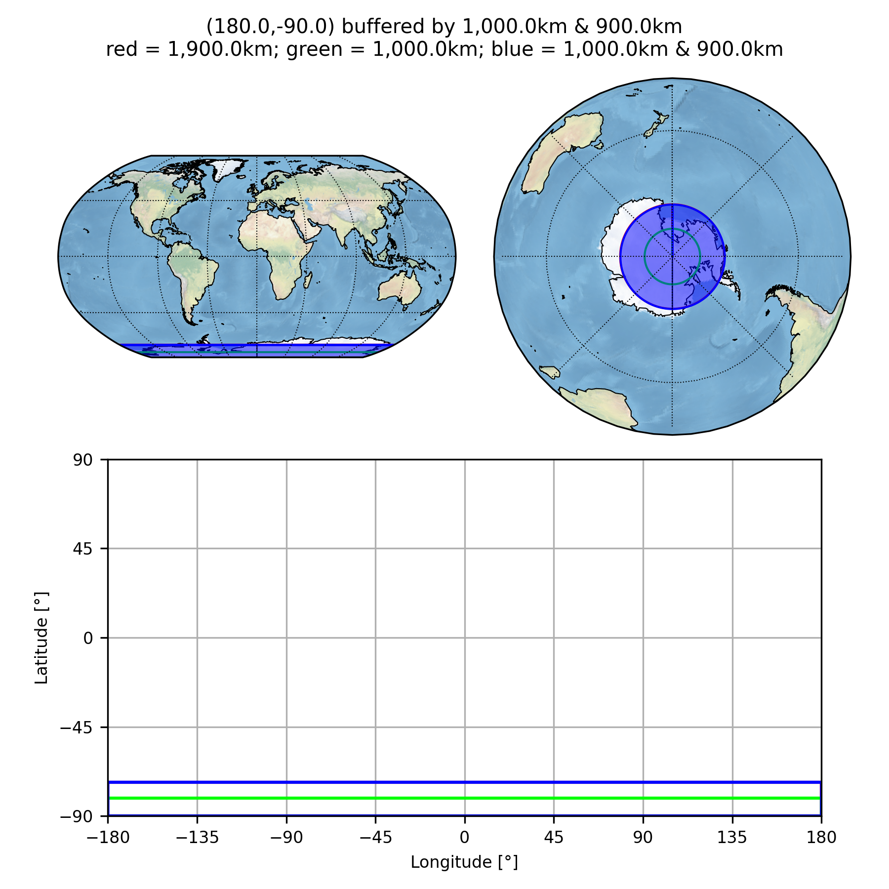
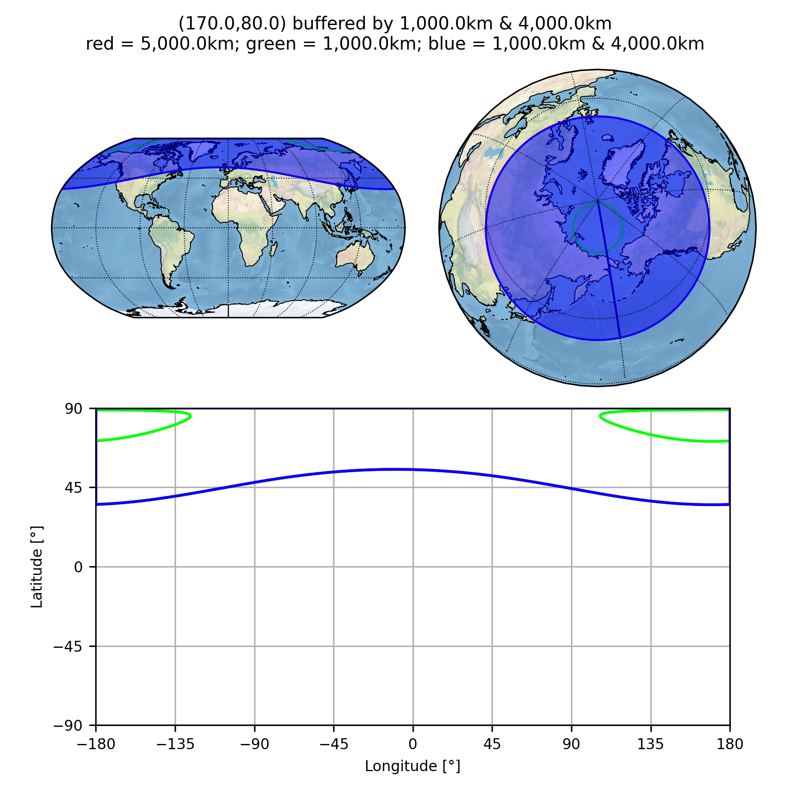

This directory contains some basic tests to (hopefully):

* find any simple bugs that I might have introduced; and
* demonstrate some simple programming techniques.

### `buffer_point()`

The function [buffer_Point](../pyguymer3/geo/buffer_Point.py) is tested by the script [bufferPoint.py](bufferPoint.py) which produces the images below.

### `buffer()`

The function [buffer](../pyguymer3/geo/buffer.py) is tested by the script [buffer.py](buffer.py) which produces the images below.

### `buffer()`

The `fill` and `simp` keyword arguments to the function [buffer](../pyguymer3/geo/buffer.py) are tested by the script [filledBuffer.py](filledBuffer.py) which produces the images below.

### `find_point_on_great_circle()`

The function [find_point_on_great_circle](../pyguymer3/geo/find_point_on_great_circle.py) is tested by the script [greatCircle.py](greatCircle.py) which produces the image below.

### `save_array_as_image()`

The function [save_array_as_image](../pyguymer3/image/save_array_as_image.py) is tested by the script [saveArrayAsImage.py](saveArrayAsImage.py) which produces the images below.

