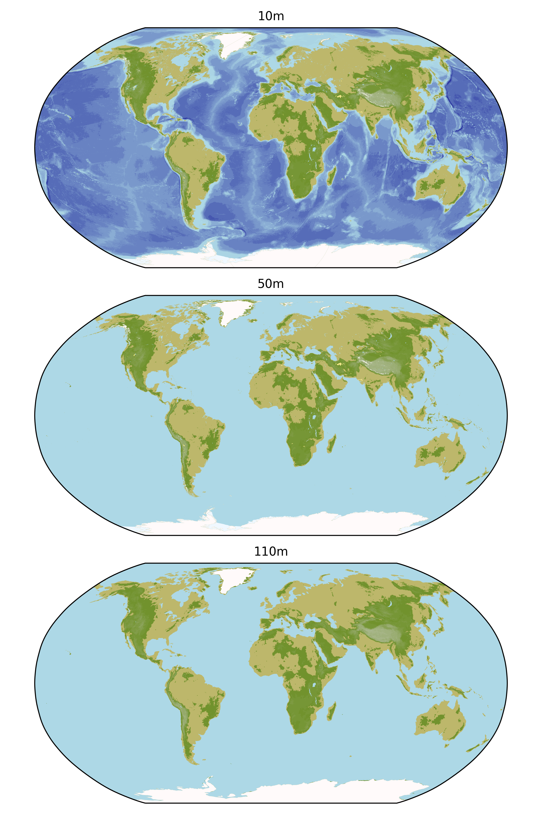
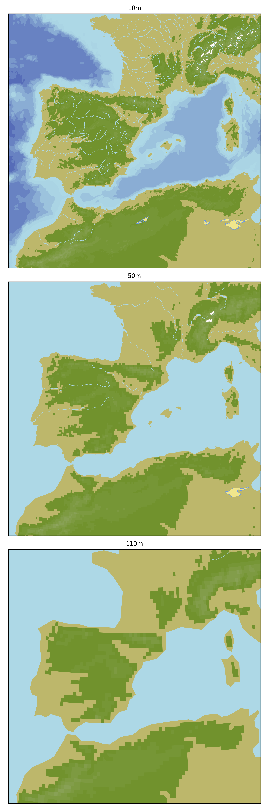
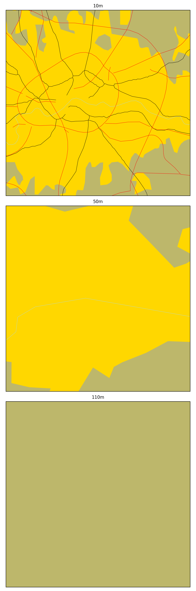
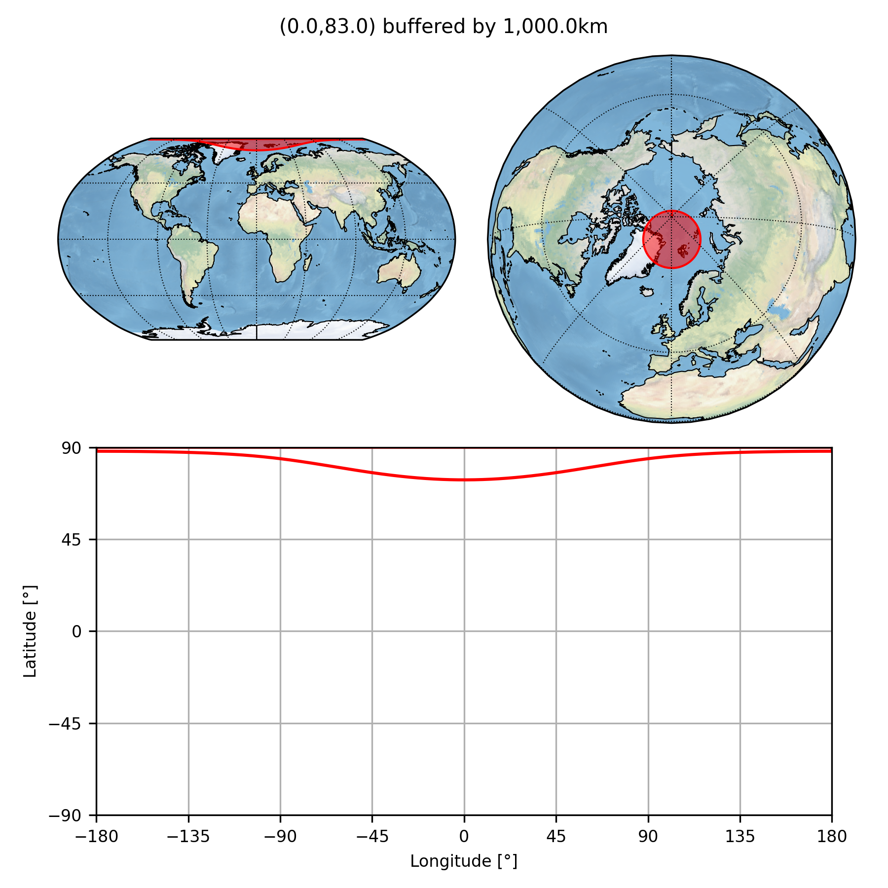
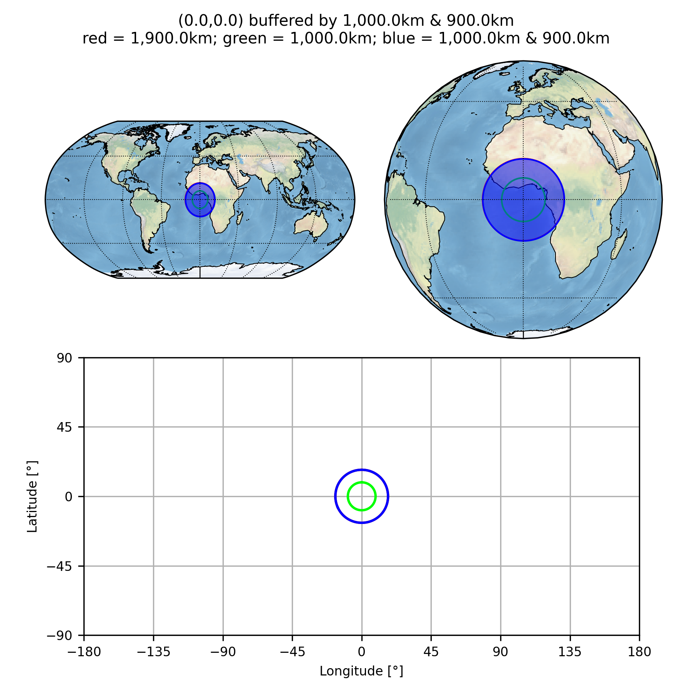
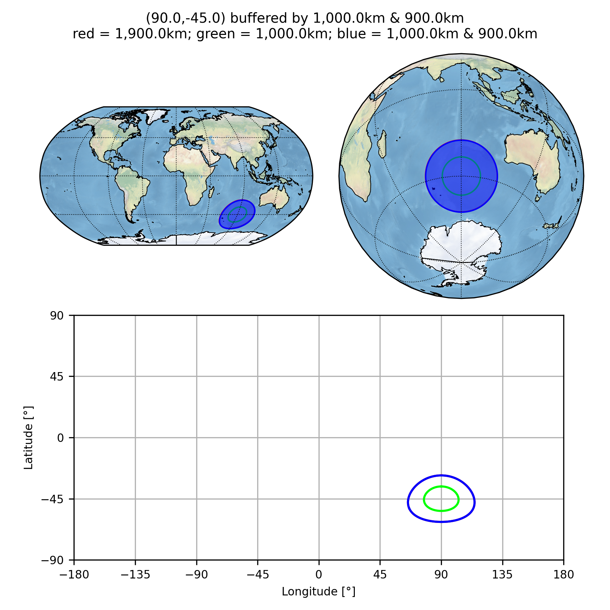
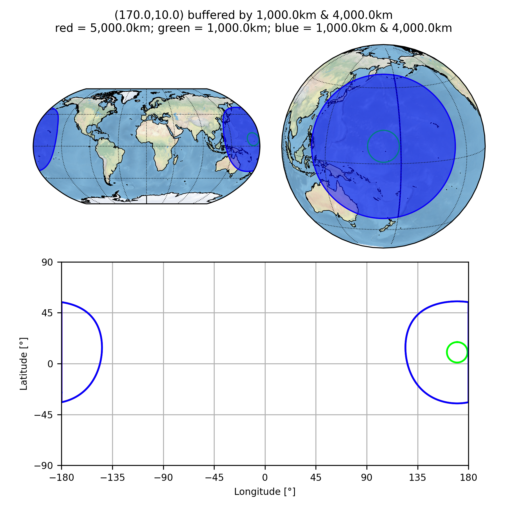
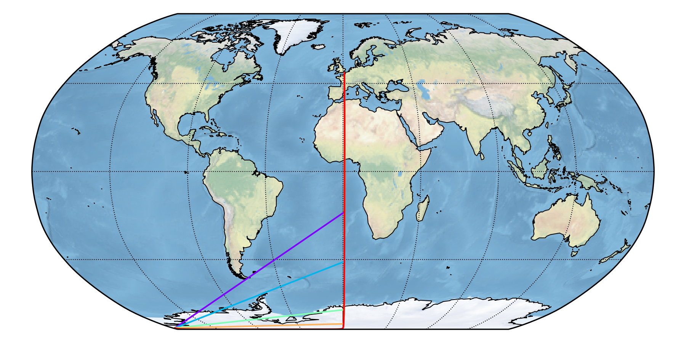
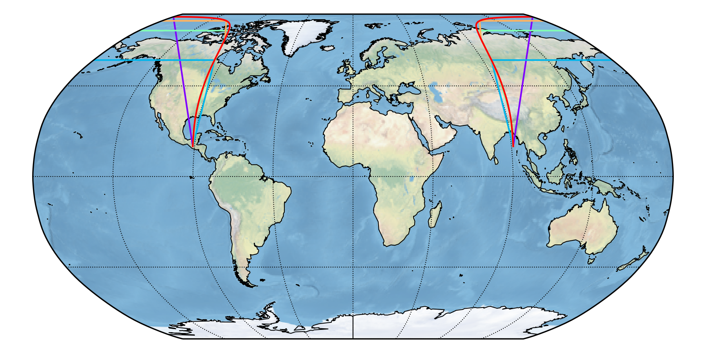

This directory contains some basic tests to (hopefully):

* find any simple bugs that I might have introduced; and
* demonstrate some simple programming techniques.

To compare the images with a previous version, try something like:

```sh
ver1="/path/to/version-1/pyguymer3/tests"
ver2="/path/to/version-2/pyguymer3/tests"
for p1 in ${ver1}/*.png; do p0="$(basename "${p1}")"; p2="${ver2}/${p0}"; h1="$(md5 -q "${p1}")"; h2="$(md5 -q "${p2}")"; [[ $h1 == $h2 ]] && continue; echo "${p0} ..."; compare "${p1}" "${p2}" "${p0}"; done
```

### `add_map_underlay()`

The function [add_map_underlay](../pyguymer3/geo/add_map_underlay.py) is tested by the script [mapUnderlay.py](mapUnderlay.py) which produces the images below.







### `buffer_point()`

The function [buffer_Point](../pyguymer3/geo/buffer_Point.py) is tested by the script [bufferPoint.py](bufferPoint.py) which produces the images below.




### `buffer()`

The function [buffer](../pyguymer3/geo/buffer.py) is tested by the script [buffer.py](buffer.py) which produces the images below.










### `great_circle()`

The function [great_circle](../pyguymer3/geo/great_circle.py) is tested by the script [greatCircle.py](greatCircle.py) which produces the image below.







### `save_array_as_image()`

The function [save_array_as_image](../pyguymer3/image/save_array_as_image.py) is tested by the script [saveArrayAsImage.py](saveArrayAsImage.py) which produces the images below.


