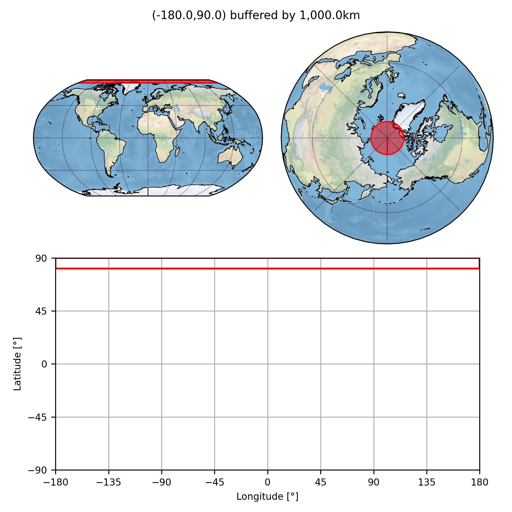
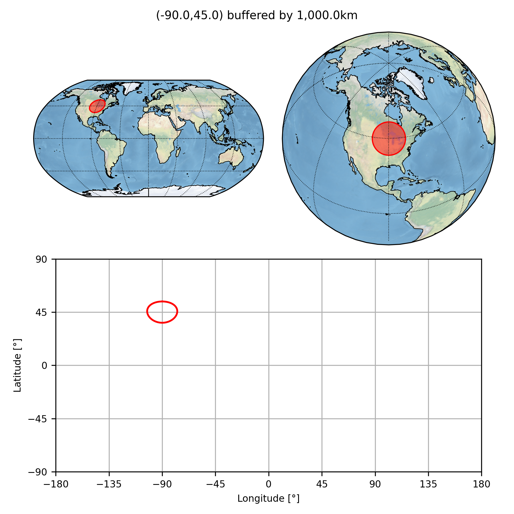
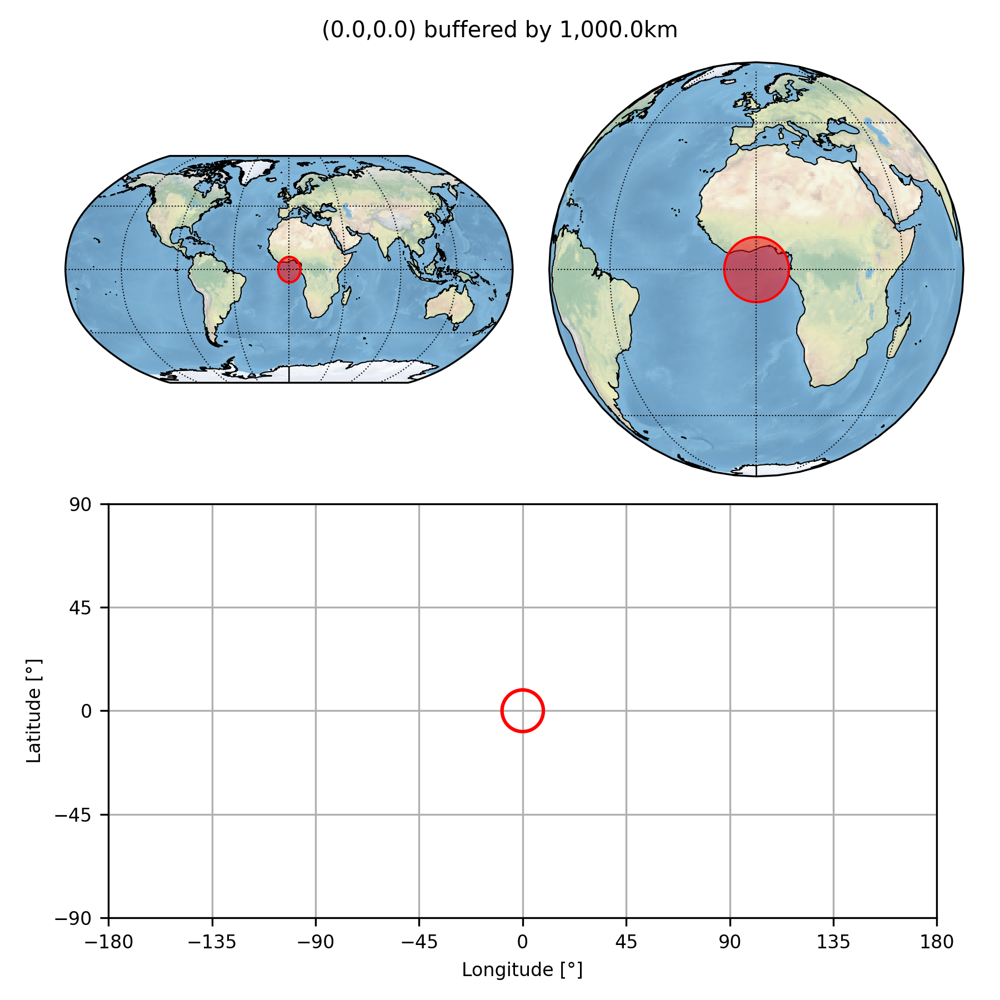
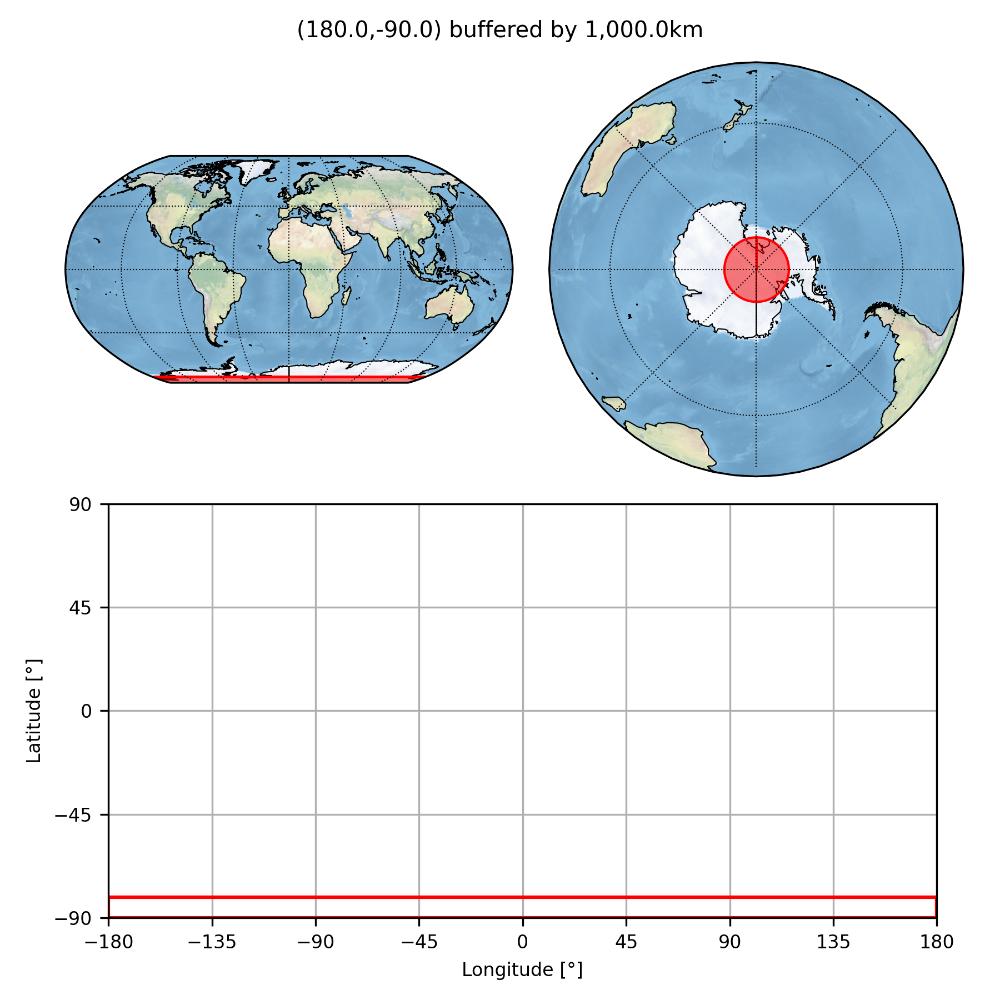
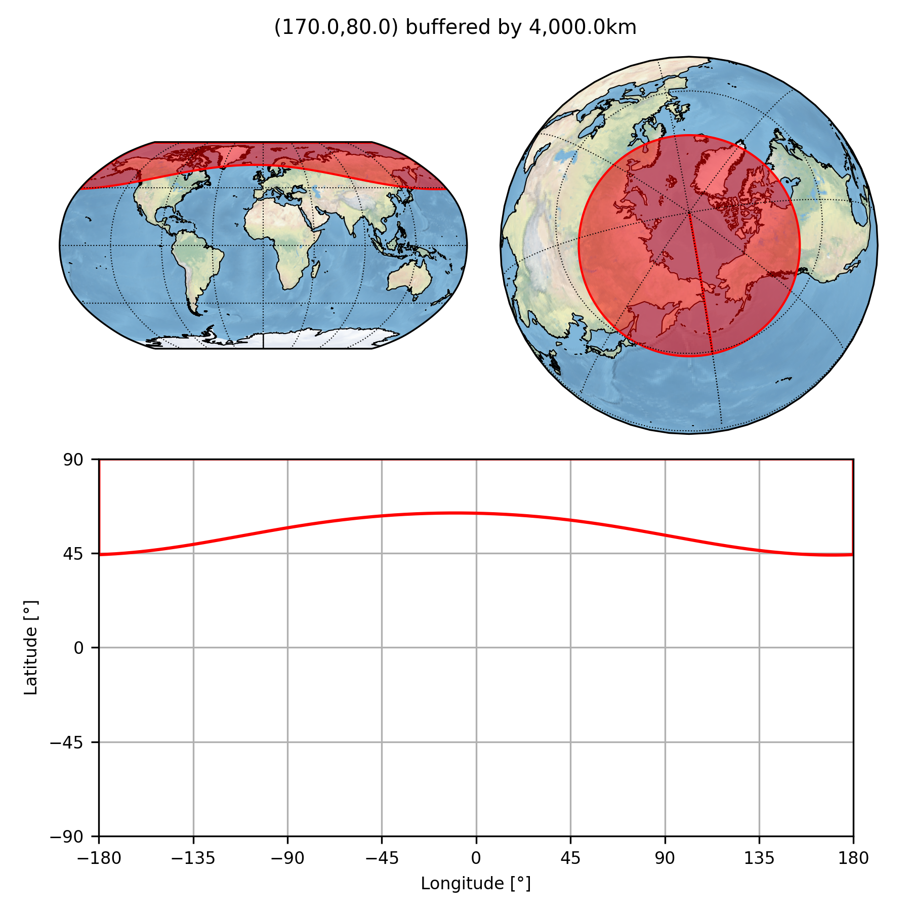

This directory contains some basic tests to (hopefully):

* find any simple bugs that I might have introduced; and
* demonstrate some simple programming techniques.

### `buffer_point()`

The function [buffer_point](../buffer_point.py) is tested by the script [bufferPoint.py](bufferPoint.py) which produces the images below.

