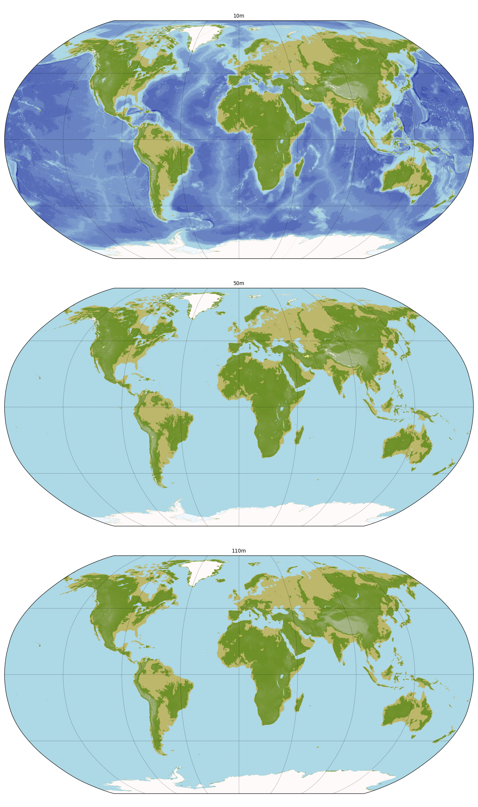

### `geo.add_map_underlay()`

The function [`geo.add_map_underlay()`](../pyguymer3/geo/add_map_underlay.py) is tested by the script [mapUnderlay.py](mapUnderlay.py) which produces the images below.

