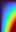

### `geo.save_array_as_image()`

The function [`geo.save_array_as_image()`](../pyguymer3/image/save_array_as_image.py) is tested by the script [saveArrayAsImage.py](saveArrayAsImage.py) which produces the images below.

